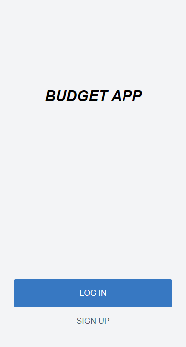
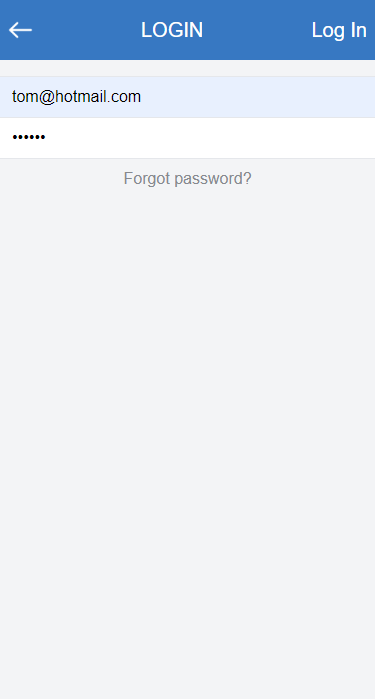
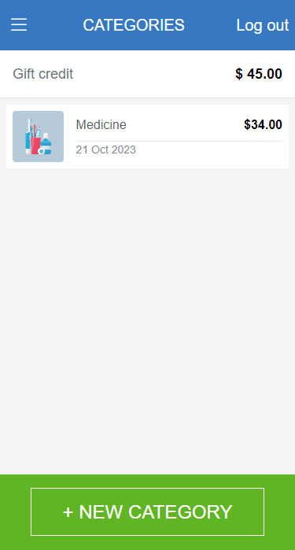
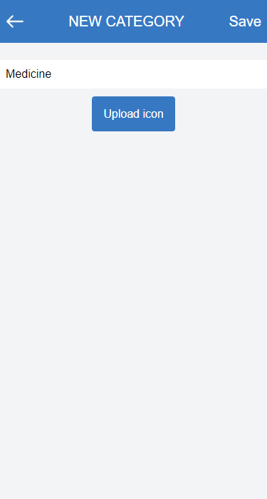
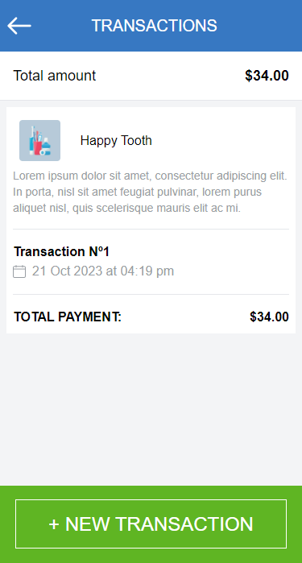
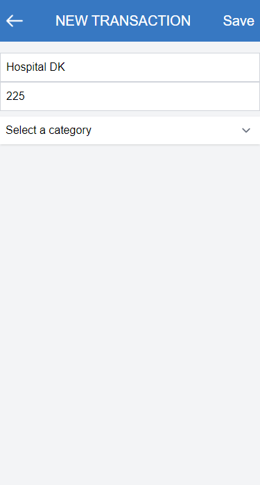

<a id="readme-top"></a>

<!-- TABLE OF CONTENTS -->

# 📗 Table of Contents

- [📖 About the Project](#about-project)
    - [🛠 Built With](#built-with)
        - [Tech Stack](#tech-stack)
        - [Key Features](#key-features)
    - [🚀 Live Demo](#live-demo)
- [💻 Getting Started](#getting-started)
    - [Prerequisites](#prerequisites)
    - [Setup](#setup)
    - [Install](#install)
    - [Usage](#usage)
    - [Run tests](#run-tests)
    - [Deployment](#deployment)
- [👥 Authors](#authors)
- [🔭 Future Features](#future-features)
- [🤝 Contributing](#contributing)
- [⭐️ Show your support](#support)
- [🙏 Acknowledgements](#acknowledgements)
- [❓ FAQ (OPTIONAL)](#faq)
- [📝 License](#license)


<!-- PROJECT DESCRIPTION -->

# 📖 Budget App <a id="about-project"></a>

**Budget App** is an application that allows users to log in and then create categories. Each category can have many transactions. The user can create transactions and assign them to a category.

Screenshots of the app:








## 🛠 Built With <a id="built-with"></a>

### Tech Stack

* Ruby on Rails.
* PostgreSQL.

<!-- Features -->

### Key Features
* Use of Rails framework.
* MVC architecture.
* Save and retrieve information from a PostgreSQL database.
* Use of Active Record to create models and migrations.
* Use of RSpec for unit testing.

<p align="right">(<a href="#readme-top">back to top</a>)</p>

<!-- LIVE DEMO -->

## 🚀 Live Demo <a name="live-demo"></a>

- [Live Demo Link](https://budget-75kc.onrender.com)

<p align="right">(<a href="#readme-top">back to top</a>)</p>

<!-- GETTING STARTED -->

## 💻 Getting Started <a id="getting-started"></a>

### Prerequisites
In order to run this project you need to have:

- Installed Ruby and Rails.
- If you're using Windows, have installed WSL.
- If you're using MacOS, an option is using UTM.

### Setup
To clone this repository to your desired folder, run the following command: <br>

```
git clone git@github.com:lRebornsl/budget-app.git
```

<p align="right">(<a href="#readme-top">back to top</a>)</p>

### Usage
To open a local server, type the following command:
```
rails server
```

<p align="right">(<a href="#readme-top">back to top</a>)</p>

### Install
To install all the ruby gems, use the following command:
```
bundle install
```
<p align="right">(<a href="#readme-top">back to top</a>)</p>

### Run tests
To run the RSpec unit tests, use the following command:
```
rspec
```

<p align="right">(<a href="#readme-top">back to top</a>)</p>

<!-- AUTHORS -->

## 👥 Authors <a id="authors"></a>

👤 **lRebornsl**

- GitHub: [@lRebornsl](https://github.com/lRebornsl)
- Twitter: [@RebornsDev](https://twitter.com/RebornsDev)
- LinkedIn: [Anthony Vásquez](https://www.linkedin.com/in/avvm98/)

<p align="right">(<a href="#readme-top">back to top</a>)</p>

<!-- FUTURE FEATURES -->

## 🔭 Future Features <a id="future-features"></a>

-[] Add a search bar to search for transactions by id.

<p align="right">(<a href="#readme-top">back to top</a>)</p>

<!-- CONTRIBUTING -->

## 🤝 Contributing <a id="contributing"></a>

Contributions, issues, and feature requests are welcome!

Feel free to check the [issues page](https://github.com/lRebornsl/budget-app/issues).

<p align="right">(<a href="#readme-top">back to top</a>)</p>

<!-- SUPPORT -->

## ⭐️ Show your support <a id="support"></a>
If you like this project please give it a star ⭐️

<p align="right">(<a href="#readme-top">back to top</a>)</p>

<!-- ACKNOWLEDGEMENTS -->

## 🙏 Acknowledgments <a id="acknowledgements"></a>

I would like to express my deepest gratitude to [Gregoire Vella](https://www.behance.net/gregoirevella) on Behance for her Original design [idea](https://www.behance.net/gallery/19759151/Snapscan-iOs-design-and-branding?tracking_source=).

<p align="right">(<a href="#readme-top">back to top</a>)</p>

<!-- LICENSE -->

## 📝 License <a id="license"></a>

This project is [MIT](./LICENSE) licensed.

<p align="right">(<a href="#readme-top">back to top</a>)</p>
